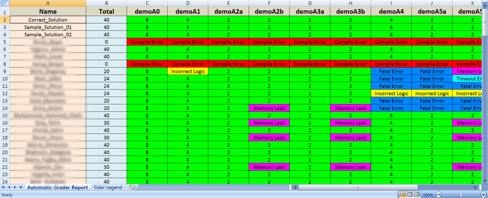

# AutoGrader-Cpp
An application to automatize the grading of coding assignments in C++. It prepares a summary
Excel file reporting compile errors, time outs, memory leaks, incorrect logic and fatal errors. 

### Requred inputs

For grading, the application uses a series of unit tests specified in ```tests.txt``` and ```tests/``` folders. 
- Each test should be on a separate line in the following format: ```[Test File Path], [Grade], [Binary 1/0 Flag for Memory Leak Testing]```. 
- For example, ```tests/test1.cpp, 40, 1```

The assignments to be graded need to be supplied in ```samples.txt``` and ```samples/``` folders. 
- Each assignment should be on a separate file in the following format: ```[Assignment File Path]```. For example, ```samples/sample1.cpp```. 

Configuration file ```config.txt``` specifies various options related to the report generation and unit tests. For example, 
- The time out duration if the compiled code is not responding
- Compiler options for gcc
- Title, font sizes and column widths for the generated reports

### Getting Started
For getting started, first compile the source code:
```
make install
```

If you would like to measure memory leaks, please make sure that ```valgrind``` is installed:
```
sudo apt install valgrind
```

Next, run the AutoGrader to prepare the report
```
./Autograder tests.txt samples.txt config.txt
```

### Outputs & Sample Report
- As an output, the application prepares a ```report.xml``` file containing the test results and grade details of each student. 
- Further details for each test are supplied under ```[Assignment File Path]/Compile_Files/``` and ```[Assignment File Path]/RunFiles/```. A summary file ```summary.txt``` is also provided for each assignment. 
- When opened in Excel, the generated reports look like the following sample output: 

